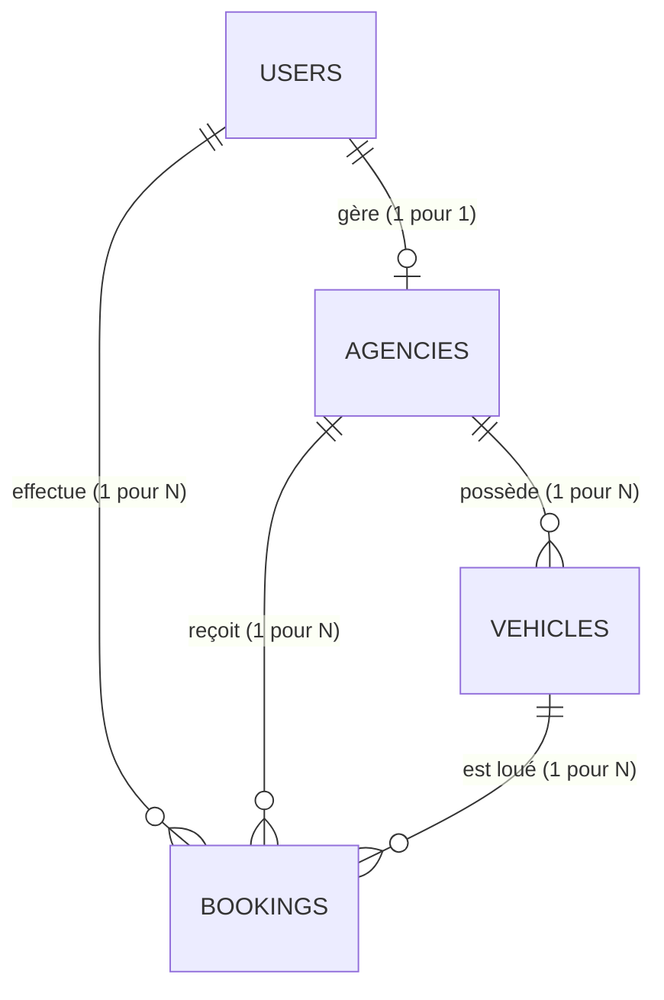

# 🛠️ Documentation Technique & Architecture - DRIVADO

Cette documentation s'adresse aux développeurs et administrateurs de la plateforme **DRIVADO**. Elle décrit en détail le fonctionnement interne, la structure des données, les règles de routage, les mécanismes de sécurité et l'intégration des services tiers (Stripe).

---

## 1. Routage & Points de Terminaison (Routes)

Le fichier de routage principal se trouve dans [routes/web.php](file:///d:/Anas/Desktop/drivado%20codebase%20v2/routes/web.php). Il est structuré en trois grands blocs : les routes publiques, le tunnel de réservation (sécurisé) et les espaces métiers (Agences & Administrateurs).

### 🌐 Routes Publiques
* `GET /` : Point d'entrée de l'application. Affiche la page d'accueil avec les 3 derniers véhicules disponibles.
* `GET /search` : Moteur de recherche et filtres de flotte.
* `GET /vehicle/{id}` : Page de détail d'un véhicule spécifique.
* `GET /how-it-works` : Guide d'utilisation et FAQ.

### 🔐 Authentification & Inscription
* `GET /login` & `POST /login` : Affichage et traitement de la connexion. Redirige dynamiquement l'utilisateur selon son rôle (`admin` vers le tableau de bord admin, `agency` vers le tableau de bord agence, et `user` vers la page d'accueil).
* `GET /register` & `POST /register` : Inscription des clients et des agences (avec champs spécifiques masqués dynamiquement via JS si l'utilisateur est un client).
* `POST /logout` : Déconnexion sécurisée de la session.

### 💳 Tunnel de Réservation (Middleware `auth`)
* `POST /checkout` : Génération du récapitulatif de paiement et calcul des frais.
* `POST /confirm` : Enregistrement de la réservation en base de données et initialisation de la transaction financière.
* `GET /booking/success/{id}` : Page de succès après la confirmation de commande.

### 🏢 Espace Agence (Middleware `auth` + `role:agency`)
Toutes les routes agences (sauf l'écran d'attente d'approbation) sont protégées par le middleware `approved_agency`.
* `GET /agency/pending` : Affiché si le dossier juridique de l'agence n'a pas encore été validé.
* `GET /agency/dashboard` : Statistiques de ventes, revenus nets et résumé des réservations de l'agence.
* `GET /agency/vehicles` : Liste de la flotte de l'agence.
* `GET /agency/vehicles/create` & `POST /agency/vehicles` : Ajout de nouveaux véhicules.

### 👑 Espace Administration (Middleware `auth` + `role:admin`)
* `GET /admin/dashboard` : Liste globale des statistiques et vue globale sur les revenus des commissions de plateforme.
* `GET /admin/agencies` : Outil de modération des dossiers d'agences candidates.
* `PATCH /admin/agencies/{id}/approve` : Approbation juridique d'une agence candidate.
* `PATCH /admin/agencies/{id}/reject` : Rejet du dossier d'une agence.

---

## 2. Architecture des Contrôleurs

L'application respecte les standards MVC de Laravel. Les contrôleurs gèrent la logique métier :

### 🔑 [AuthController.php](file:///d:/Anas/Desktop/drivado%20codebase%20v2/app/Http/Controllers/AuthController.php)
* **Connexion :** Gère la vérification des identifiants et redirige intelligemment vers le bon tableau de bord ou la page d'accueil.
* **Inscription hybride :** Détermine si le compte créé est un `client` ou une `agence`. Si c'est une agence, il crée simultanément une entrée dans la table `agencies` liée à l'utilisateur, avec le statut `is_approved = false` par défaut pour forcer la modération.

### 🚗 [BookingController.php](file:///d:/Anas/Desktop/drivado%20codebase%20v2/app/Http/Controllers/BookingController.php)
* **Recherche Avancée :** Exécute des filtres relationnels Eloquent complexes sur la table `vehicles` en fonction de la ville, de la catégorie, et du budget quotidien (prix min et prix max).
* **Calcul des Coûts :** Calcule dynamiquement le nombre de jours de location à partir des dates transmises. Il applique ensuite le taux de commission de plateforme (configuré via `.env` et par défaut à 10 %) pour obtenir le sous-total, le montant de la commission, et le prix total de la réservation.
* **Cinématique de validation :** Enregistre la réservation avec le statut `pending` et redirige le client vers l'écran de confirmation.

### 🏢 [AgencyController.php](file:///d:/Anas/Desktop/drivado%20codebase%20v2/app/Http/Controllers/AgencyController.php) & [AdminController.php](file:///d:/Anas/Desktop/drivado%20codebase%20v2/app/Http/Controllers/AdminController.php)
* **AgencyController :** Gère l'alimentation du tableau de bord de l'agence (réservations reçues, revenus nets après déduction de la commission de 10 %) et la création sécurisée des véhicules avec validation des entrées.
* **AdminController :** Centralise la gestion administrative globale. Il liste les agences en attente de modération et met à jour leur champ `is_approved`.

---

## 3. Système de Droits & Middlewares

La sécurité de la plateforme repose sur deux middlewares spécifiques :

### 🛡️ [RoleMiddleware.php](file:///d:/Anas/Desktop/drivado%20codebase%20v2/app/Http/Middleware/RoleMiddleware.php)
Ce middleware compare le champ `role` de l'utilisateur connecté avec les rôles autorisés pour la route :
```php
if (!Auth::check() || !in_array(Auth::user()->role, $roles)) {
    abort(403, 'Accès non autorisé.');
}
```

### 🛡️ [ApprovedAgencyMiddleware.php](file:///d:/Anas/Desktop/drivado%20codebase%20v2/app/Http/Middleware/ApprovedAgencyMiddleware.php)
Ce middleware est appliqué uniquement au groupe de routes de gestion de flotte des agences. Il vérifie si l'agence associée à l'utilisateur connecté possède le flag `is_approved = true`. Si ce n'est pas le cas, elle est redirigée vers la route `agency.pending` pour l'informer que son dossier est en attente d'approbation administrative :
```php
if (Auth::user()->role === 'agency' && (!Auth::user()->agency || !Auth::user()->agency->is_approved)) {
    return redirect()->route('agency.pending');
}
```

---

## 4. Modélisation de la Base de Données

L'application utilise un schéma relationnel propre et normalisé :



### Principales Tables & Relations :
1. **`users`** : Contient les informations d'authentification globales (nom, e-mail, téléphone, mot de passe) et le champ clé `role` (`admin`, `agency`, `user`).
2. **`agencies`** (`belongsTo` users) : Liée aux utilisateurs de rôle `agency`. Stocke le nom commercial, l'identifiant juridique (`legal_id`), la ville, l'adresse, les coordonnées géographiques (`latitude`, `longitude`) et le flag de modération `is_approved`.
3. **`vehicles`** (`belongsTo` agencies) : Liste les véhicules de la plateforme. Stocke la marque, le modèle, la catégorie, le prix par jour, la description, les options (stockées au format JSON casté en array) et le statut `is_available`.
4. **`bookings`** (`belongsTo` users, agencies, vehicles) : Enregistre les détails d'une location : dates de début et fin, nombre de jours, sous-total, montant de la commission, total final payé, et statut de réservation (`pending`, `confirmed`, `cancelled`).

---

## 5. Cinématique des Paiements & Stripe

La facturation de la plateforme fonctionne de manière transparente :
1. **Commission de Plateforme :** Configurée par le paramètre `COMMISSION_RATE` dans le fichier `.env` (par défaut `10`).
2. **Calcul backend :**
   $$\text{Sous-total} = \text{Prix par jour} \times \text{Nombre de jours}$$
   $$\text{Commission} = \text{Sous-total} \times \left( \frac{\text{Taux de commission}}{100} \right)$$
   $$\text{Total} = \text{Sous-total} + \text{Commission}$$
3. **Transaction sécurisée :** Au clic sur "Confirmer & Payer", les clés API Stripe Sandbox de l'environnement `.env` sont appelées pour sécuriser et valider la transaction.

---

## 6. Design System & Variables CSS

L'identité visuelle de **DRIVADO** est définie dans le fichier [resources/css/index.css](file:///d:/Anas/Desktop/drivado%20codebase%20v2/resources/css/index.css) :

* **Variables de couleurs clés :**
  * `--primary-black` : `#0A0B0F` (un noir profond et luxueux).
  * `--secondary-dark` : `#12141C` (utilisé pour les cartes et les surfaces surélevées).
  * `--accent-silver` : `#E8E8E8` (gris métallisé brossé).
  * `--glass-bg` : `rgba(18, 20, 28, 0.75)` (fond flouté effet verre).
* **Dégradé Métallique de Marque :** Utilisé sur le logo textuel dans le header et le footer pour créer un effet d'aluminium brossé :
  ```css
  background: linear-gradient(135deg, #FFFFFF 0%, #E8E8E8 50%, #C0C0C0 100%);
  -webkit-background-clip: text;
  -webkit-text-fill-color: transparent;
  ```
* **Effet Sticky Navbar :** Réduction dynamique de la taille du logo au scroll de la page grâce aux transitions CSS de `.logo-car-img` (de `45px` à `35px` de hauteur) et `.logo-text` (de `1.6rem` à `1.3rem`).

---
*Fin de la documentation technique.*
