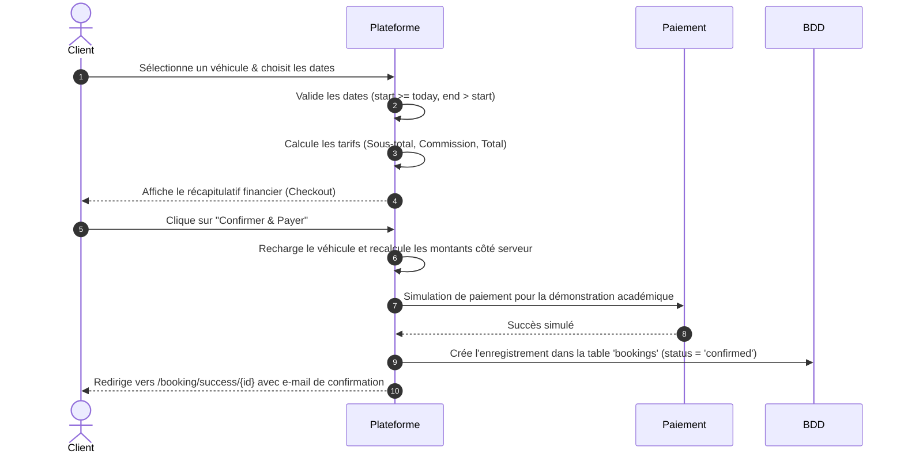

# 🛠️ Documentation Technique & Architecture - DRIVADO

Cette documentation s'adresse aux développeurs et administrateurs de la plateforme **DRIVADO**. Elle décrit en détail le fonctionnement interne, la structure des données, les règles de routage, les mécanismes de sécurité et l'intégration des services de la marketplace premium.

---

## 📖 Sommaire
1. [Arborescence du Projet](#1-arborescence-du-projet)
2. [Routage & Points de Terminaison](#2-routage--points-de-terminaison)
3. [Architecture des Contrôleurs](#3-architecture-des-contrôleurs)
4. [Schéma Détaillé de la Base de Données](#4-schéma-détaillé-de-la-base-de-données)
5. [Système de Sécurité, Rôles & Middlewares](#5-système-de-sécurité-rôles--middlewares)
6. [Cinématique du Tunnel de Réservation](#6-cinématique-du-tunnel-de-réservation)
7. [Design System & Intégration Graphique](#7-design-system--intégration-graphique)
8. [Guide d'Extension de la Marketplace](#8-guide-dextension-de-la-marketplace)

---

## 1. Arborescence du Projet

Pour faciliter la navigation des développeurs, voici les emplacements des fichiers clés de l'application :

```text
drivado-codebase-v2/
├── app/
│   ├── Http/
│   │   ├── Controllers/
│   │   │   ├── AdminController.php       # Modération des agences & stats admin
│   │   │   ├── AgencyController.php      # Gestion de flotte & dashboard agence
│   │   │   ├── AuthController.php        # Inscription hybride & authentification
│   │   │   └── BookingController.php     # Recherche avancée & flux de paiement
│   │   └── Middleware/
│   │       ├── ApprovedAgencyMiddleware.php  # Restriction d'accès agences en attente
│   │       └── RoleMiddleware.php            # Contrôle d'accès par rôle (client/admin)
│   └── Models/
│       ├── User.php                      # Utilisateur de base (role = admin, agency, user)
│       ├── Agency.php                    # Détails légaux, coordonnées géographiques & statut
│       ├── Vehicle.php                   # Spécifications du véhicule, options JSON
│       └── Booking.php                   # Détails financiers de la location
├── config/                               # Fichiers de configuration système (app.php, database.php)
├── database/
│   ├── migrations/                       # Définition des structures de tables de la BDD
│   └── seeders/                          # Données de test & profils prédéfinis
├── resources/
│   ├── css/
│   │   └── index.css                     # Design System (dégradés, verre dépoli, animations)
│   └── views/
│       ├── auth/                         # Formulaires d'inscription & de connexion
│       ├── layouts/
│       │   └── main.blade.php            # Master template global avec header/footer premium
│       ├── agency/                       # Vues dashboard agence & écran d'attente pending
│       ├── admin/                        # Vues administration de modération
│       ├── index.blade.php               # Page d'accueil premium
│       ├── search.blade.php              # Recherche avec carte géographique (LeafletJS)
│       ├── detail.blade.php              # Fiche technique véhicule & widget de réservation
│       ├── checkout.blade.php            # Récapitulatif financier
│       └── success.blade.php             # Écran de félicitations post-achat
└── routes/
    └── web.php                           # Définition de toutes les URL & politiques d'accès
```

---

## 2. Routage & Points de Terminaison

Toutes les URL de l'application sont déclarées dans [routes/web.php](file:///d:/Anas/Desktop/drivado%20codebase%20v2/routes/web.php).

| Méthode | URI | Contrôleur / Action | Accès | Description |
| :--- | :--- | :--- | :--- | :--- |
| `GET` | `/` | *Closure* | Public | Page d'accueil avec les 3 derniers véhicules disponibles |
| `GET` | `/search` | `BookingController@search` | Public | Moteur de recherche multicritères + Carte interactive |
| `GET` | `/vehicle/{id}` | `BookingController@show` | Public | Détails techniques d'un véhicule et options |
| `GET` | `/how-it-works` | *Closure* | Public | Foire aux Questions (FAQ) et guide d'utilisation |
| `GET` | `/login` | `AuthController@showLogin` | Public | Formulaire de connexion |
| `POST` | `/login` | `AuthController@login` | Public | Traitement de la connexion |
| `GET` | `/register` | `AuthController@showRegister` | Public | Formulaire d'inscription (Client & Agence) |
| `POST` | `/register` | `AuthController@register` | Public | Traitement de la création de compte hybride |
| `POST` | `/logout` | `AuthController@logout` | Connecté | Déconnexion de la session en cours |
| `POST` | `/checkout` | `BookingController@checkout` | Connecté | Résumé financier pré-paiement |
| `POST` | `/confirm` | `BookingController@confirm` | Connecté | Confirmation de réservation & écriture BDD |
| `GET` | `/booking/success/{id}`| `BookingController@success`| Connecté | Écran de succès de paiement |
| `GET` | `/agency/pending` | *Closure* | Agence | Écran d'attente de modération administrative |
| `GET` | `/agency/dashboard`| `AgencyController@dashboard`| Agence Validée | Statistiques de ventes & revenus agence |
| `GET` | `/agency/vehicles` | `AgencyController@vehicles` | Agence Validée | Inventaire de flotte de l'agence |
| `POST`| `/agency/vehicles` | `AgencyController@storeVehicle` | Agence Validée | Enregistrement d'un nouveau véhicule |
| `GET` | `/admin/dashboard` | `AdminController@dashboard` | Admin | Synthèse globale des ventes & commissions globales |
| `GET` | `/admin/agencies` | `AdminController@agencies` | Admin | Modération administrative des dossiers d'agences |
| `PATCH`| `/admin/agencies/{id}/approve` | `AdminController@approveAgency`| Admin | Validation légale de l'agence candidate |
| `PATCH`| `/admin/agencies/{id}/reject` | `AdminController@rejectAgency`| Admin | Rejet administratif de l'agence candidate |

---

## 3. Architecture des Contrôleurs

Les contrôleurs encapsulent l'intégralité de la logique métier. Voici le détail de leur implémentation technique :

### 🔑 [AuthController.php](file:///d:/Anas/Desktop/drivado%20codebase%20v2/app/Http/Controllers/AuthController.php)
Ce contrôleur orchestre le cycle de vie de la session utilisateur et le routage des rôles.
* **Redirection dynamique des Rôles :** Lors d'une connexion réussie, la méthode `login` analyse le rôle attribué à l'utilisateur :
  ```php
  if ($user->role === 'admin') {
      return redirect()->route('admin.dashboard');
  } elseif ($user->role === 'agency') {
      return redirect()->route('agency.dashboard');
  }
  return redirect('/');
  ```
* **Inscription Hybride :** Si le formulaire sélectionné possède le rôle `agency`, le contrôleur effectue simultanément la création de l'utilisateur principal et de la fiche agence associée (`status = pending` par défaut). Il utilise une transaction de base de données pour garantir l'intégrité de la création du compte et du profil agence.

### 🚗 [BookingController.php](file:///d:/Anas/Desktop/drivado%20codebase%20v2/app/Http/Controllers/BookingController.php)
Il prend en charge le moteur de recherche et le calcul dynamique des prix du tunnel de vente :
* **Recherche de Flotte :** Utilise des requêtes Eloquent optimisées avec préchargement relationnel (`with('agency')`) et des conditions imbriquées :
  ```php
  $query = Vehicle::with('agency')->where('is_available', true);
  if ($request->filled('location')) {
      $query->whereHas('agency', function($q) use ($request) {
          $q->where('city', 'like', '%' . $request->location . '%');
      });
  }
  ```
* **Formule des Prix :** Lors de l'envoi de la date de début et de la date de fin, le contrôleur utilise la bibliothèque `Carbon` pour calculer la durée exacte en jours et déduire le montant total en appliquant le taux de commission de la plateforme :
  ```php
  $start = Carbon::parse($request->start_date);
  $end = Carbon::parse($request->end_date);
  $days = $start->diffInDays($end);
  $subtotal = $days * $vehicle->price_per_day;
  $commission_rate = config('app.commission_rate', 10);
  $commission_amount = ($subtotal * $commission_rate) / 100;
  $total = $subtotal + $commission_amount;
  ```
* **Confirmation sécurisée :** La méthode `confirm` ne fait pas confiance aux montants envoyés par le navigateur. Elle recharge le véhicule depuis MySQL, recalcule la durée, le sous-total, la commission et le total, puis utilise l'agence liée au véhicule. Cette approche empêche un utilisateur de modifier les champs cachés du formulaire pour changer le prix.
* **Protection des réservations :** La méthode `success` vérifie que l'utilisateur connecté est le propriétaire de la réservation, un administrateur, ou l'agence concernée avant d'afficher les détails.

---

## 4. Schéma Détaillé de la Base de Données

Les données sont normalisées et stockées avec des contraintes de clés primaires et secondaires strictes pour empêcher toute corruption d'enregistrements.

### Table `users`
Stocke tous les comptes utilisateurs de l'écosystème.
* `id` : `BIGINT(20) UNSIGNED` (Clé primaire)
* `name` : `VARCHAR(255)` (Nom ou prénom)
* `email` : `VARCHAR(255)` (Unique)
* `phone` : `VARCHAR(255)`
* `role` : `ENUM('admin', 'agency', 'user')` (Défaut : `user`)
* `password` : `VARCHAR(255)`
* `timestamps` : `created_at` et `updated_at`

### Table `agencies`
Contient les informations juridiques des agences.
* `id` : `BIGINT(20) UNSIGNED` (Clé primaire)
* `user_id` : `BIGINT(20) UNSIGNED` (Clé étrangère ➡️ `users.id`, suppression en cascade)
* `agency_name` : `VARCHAR(255)`
* `legal_id` : `VARCHAR(255)` (ICE ou SIRET)
* `address` : `TEXT`
* `city` : `VARCHAR(255)`
* `latitude` : `DECIMAL(10, 8)` (Géolocalisation carte)
* `longitude` : `DECIMAL(11, 8)` (Géolocalisation carte)
* `phone` : `VARCHAR(255)`
* `status` : `ENUM('pending', 'approved', 'rejected')` (Défaut : `pending`)
* `timestamps`

### Table `vehicles`
Représente le catalogue de voitures mis en location.
* `id` : `BIGINT(20) UNSIGNED` (Clé primaire)
* `agency_id` : `BIGINT(20) UNSIGNED` (Clé étrangère ➡️ `agencies.id`, suppression en cascade)
* `make` : `VARCHAR(255)` (Marque, ex: *Mercedes-Benz*)
* `model` : `VARCHAR(255)` (Modèle, ex: *Classe G*)
* `year` : `YEAR`
* `category` : `ENUM('suv', 'sedan', 'city', 'utility', 'luxury')`
* `description` : `TEXT`
* `price_per_day` : `DECIMAL(10, 2)` (Tarif journalier)
* `options` : `JSON` (Stocké sous forme de tableau JSON, ex: `["Automatique", "GPS", "Sièges Cuir"]`)
* `cancellation_policy` : `TEXT` (Politique d'annulation de l'agence)
* `is_available` : `BOOLEAN` (Défaut : `true`)
* `timestamps`

### Table `bookings`
Historique financier de toutes les locations passées sur la plateforme.
* `id` : `BIGINT(20) UNSIGNED` (Clé primaire)
* `user_id` : `BIGINT(20) UNSIGNED` (Clé étrangère ➡️ `users.id`, suppression en cascade)
* `vehicle_id` : `BIGINT(20) UNSIGNED` (Clé étrangère ➡️ `vehicles.id`, suppression en cascade)
* `agency_id` : `BIGINT(20) UNSIGNED` (Clé étrangère ➡️ `agencies.id`, suppression en cascade)
* `start_date` : `DATE` (Date de départ)
* `end_date` : `DATE` (Date de retour)
* `total_days` : `INTEGER` (Nombre de jours calculé)
* `subtotal` : `DECIMAL(10, 2)` (Revenu brut)
* `commission_rate` : `DECIMAL(5, 2)` (Pourcentage de frais de plateforme, défaut : 10.00 %)
* `commission_amount` : `DECIMAL(10, 2)` (Frais prélevés par la plateforme)
* `total_amount` : `DECIMAL(10, 2)` (Montant net facturé au client)
* `status` : `ENUM('pending', 'confirmed', 'completed', 'cancelled', 'failed')` (Défaut : `pending`)
* `timestamps`

---

## 5. Système de Sécurité, Rôles & Middlewares

### 🛡️ Rôles Utilisateurs
1. **`user` :** Accès au catalogue public, recherche avancée, fiche technique et possibilité d'effectuer une commande.
2. **`agency` :** Accès restreint. Si `status !== 'approved'`, l'agence est bloquée sur l'écran d'attente `agency.pending` et ne peut rien faire d'autre. Si validée, elle accède à son tableau de bord de statistiques, à sa liste de flotte et peut ajouter des véhicules.
3. **`admin` :** Accès global à l'outil d'approbation et aux graphiques consolidés des revenus de la plateforme.

### 🛡️ Implémentation du Middleware [ApprovedAgencyMiddleware.php](file:///d:/Anas/Desktop/drivado%20codebase%20v2/app/Http/Middleware/ApprovedAgencyMiddleware.php)
Ce middleware protège le catalogue d'administration des agences partenaires pour empêcher l'insertion précoce de voitures par des agences non vérifiées :
```php
public function handle(Request $request, Closure $next): Response
{
    $user = auth()->user();

    if ($user->role === 'agency') {
        $agency = $user->agency;
        
        // Redirige vers l'écran d'attente si le statut n'est pas 'approved'
        if (!$agency || $agency->status !== 'approved') {
            return redirect()->route('agency.pending')
                ->with('error', 'Votre compte agence est en attente d\'approbation administrative.');
        }
    }

    return $next($request);
}
```

---

## 6. Cinématique du Tunnel de Réservation

Le parcours de commande respecte une cinématique d'états sécurisée :



> Note : le package Stripe est installé et la documentation prévoit l'intégration d'une passerelle réelle, mais le projet actuel simule le paiement afin de rester simple pour la démonstration.

---

## 7. Design System & Intégration Graphique

Le Design System de **DRIVADO** est caractérisé par un style luxueux sombre intégrant les dernières tendances UI :

### 🎨 Charte de Couleurs (CSS Variables)
* `background-color` principal : `#0A0B0F` (un noir nocturne profond).
* `surface-color` secondaire : `#12141C` (utilisé pour faire ressortir les cartes et modules).
* `accent-color` : `#E8E8E8` (effet aluminium métallisé brossé).
* `glassmorphism` : `rgba(18, 20, 28, 0.75)` couplé avec un filtre `backdrop-filter: blur(15px)` pour un effet de transparence de haute qualité.

### 🚗 Logo Réactif au Défilement
Pour garantir une navigation épurée, le logo (disponible sous [public/images/logo.png](file:///d:/Anas/Desktop/drivado%20codebase%20v2/public/images/logo.png)) et son texte sont associés à des transitions fluides dans [resources/css/index.css](file:///d:/Anas/Desktop/drivado%20codebase%20v2/resources/css/index.css) :
* **Dégradé de marque 3D :** Un dégradé linéaire imitant le reflet de l'acier poli :
  ```css
  background: linear-gradient(135deg, #FFFFFF 0%, #E8E8E8 50%, #C0C0C0 100%);
  -webkit-background-clip: text;
  -webkit-text-fill-color: transparent;
  ```
* **Effet de défilement (scrolled) :** Lorsque la navbar passe en mode `.scrolled`, l'image de la silhouette de voiture diminue sa hauteur de `45px` à `35px` et la taille du texte passe de `1.6rem` à `1.3rem` pour libérer de l'espace visuel sur l'écran.

---

## 8. Guide d'Extension de la Marketplace

### 💡 Comment ajouter une nouvelle catégorie de véhicules ?
1. Modifiez la colonne `category` dans la migration [vehicles_table.php](file:///d:/Anas/Desktop/drivado%20codebase%20v2/database/migrations/2026_05_04_105314_create_vehicles_table.php) pour y ajouter votre catégorie (ex: `cabriolet`) :
   ```php
   $table->enum('category', ['suv', 'sedan', 'city', 'utility', 'luxury', 'cabriolet']);
   ```
2. Ajoutez l'option dans la vue de filtre de [search.blade.php](file:///d:/Anas/Desktop/drivado%20codebase%20v2/resources/views/search.blade.php) et dans les formulaires d'ajout de véhicule de l'agence.
3. Exécutez `php artisan migrate:refresh --seed` pour recharger la base de données propre.

### 💡 Comment changer la passerelle de paiement ?
Pour remplacer Stripe par une autre solution (comme PayPal ou Wafacash) :
1. Installez le SDK de la passerelle via Composer.
2. Modifiez la méthode `confirm` dans [BookingController.php](file:///d:/Anas/Desktop/drivado%20codebase%20v2/app/Http/Controllers/BookingController.php) pour y insérer l'appel API de la passerelle au lieu de la simulation.
3. Gérez le callback de retour de paiement pour passer le statut de la table `bookings` de `pending` à `confirmed`.

---
*Fin de la documentation technique avancée.*
